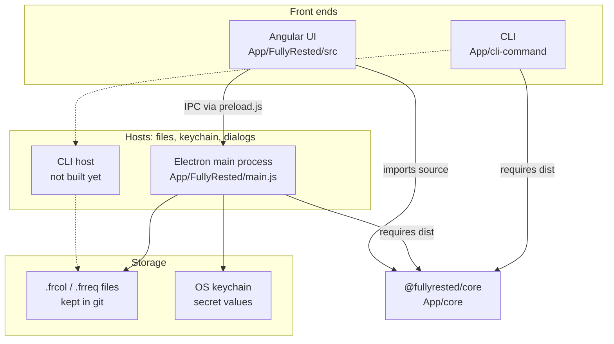

# FullyRested

Purpose: a desktop REST client whose requests are git-friendly JSON files,
with one shared engine behind both the desktop app and a command-line
runner. The intent and the user-facing concepts are in
[`README.md`](README.md).

## Tech stack

Angular 14 UI in an Electron 27 desktop shell / TypeScript core library
(CommonJS; axios, Ajv, `@smithy/signature-v4`) / Node CLI (commander).
Nothing is deployed to AWS: the app is a local desktop app.

## Layers

| Layer | Where | Job |
|---|---|---|
| Front ends | `App/FullyRested/src` (Angular), `App/cli-command` | Collect input and show results. Should hold no request logic of their own |
| Hosts | `App/FullyRested/main.js` + `preload.js` | Node-only work: reading and writing files, the keychain (`keytar`), dialogs, and the process that sends requests. The CLI has no host yet |
| Core | `App/core/src` | The engine: model, request builder, `{{var}}` / `{{$secret}}` substitution, auth, sending, validation, moving secrets in and out of a `SecretStore` |
| Storage | Collection folder on disk + OS keychain | The data. Secrets are held as references in files and as values in the keychain |

Core has no `node:` or `fs` imports, because the Angular build bundles its
source into the renderer. It compiles to CommonJS with no ESM-only
dependencies, because Electron 27's Node 18 can't `require()` ESM. Anything
that touches the machine belongs in a host. `docs/reviews/2026-09-29-review.md`
records why the packages are linked with `file:` rather than npm workspaces.

## The request pipeline: what's shared

The goal is that the UI and the CLI run one pipeline. Today only the middle
of it lives in core:

| Step | Where it lives | Shared? |
|---|---|---|
| Load a file and fill in its secrets | `main.js` (`loadRequest`, `loadCollectionFromFile`) calling core `loadSecrets` | Secret handling yes; file reading is host work |
| Fill in fields missing from older files | `ActionRepositoryService.patchRequest` (Angular) | **No** |
| Resolve settings: run → request → environment → collection | `edit-request-run.component.ts` `test()` and `onParamChange()` (URL plus params through Angular's `UrlTree`), then `ExecuteRestCallsService.executeTest`. Both use core's `ExecuteRestAction` builder methods | **Partly.** The merge operations are in core; the order they're applied in is in Angular |
| Substitute variables and secrets | core `replaceVariables` / `substituteDeep` | Yes |
| Authenticate and send | core `executeRequest`, called in `main.js` over the `testRest` IPC channel | Yes |
| Validate the response | core `validateResponse`, called from the renderer | Yes |
| Report | Angular response components | CLI reporting not built |

Two rows marked "No" or "Partly" block the CLI from running a request
exactly as the UI does. The kanban story "Resolve requests outside Angular"
(`c74f3717-c3d1-4db9-b139-7687a900935b`) moves them into core.

## Where the plan lives

On the BlueFinWiki kanban board, under initiative **AI Refresh**
(`e58ec7d8-09c2-4d67-81b7-9b1b2e72d989`), with epics for the core engine,
secrets hygiene, the CLI runner, the stack upgrade and cleanup. Home's
`configuration/fullyrested/config.json` maps this repo to that initiative.
`docs/reviews/` holds dated reviews; they are snapshots, not living docs.

## Running it

Build order: the app's main process and the CLI load core's compiled
`dist/`, so build core before either. The Angular build compiles core's
source directly, through a `paths` mapping in `App/FullyRested/tsconfig.json`.

| Task | Command (from the folder shown) |
|---|---|
| Build core | `App/core`: `npm install && npm run build` |
| Test core (vitest) | `App/core`: `npm test` |
| Run the desktop app | `App/FullyRested`: `npm run electron` (builds core, runs `ng build`, starts Electron) |
| UI only, in a browser | `App/FullyRested`: `ng serve`. With no Electron IPC, the repository and execute services return built-in mock data |
| Angular unit tests | `App/FullyRested`: `npm test`. The specs are still CLI boilerplate |
| Package installers | `App/FullyRested`: `npm run make` (electron-forge). Not yet checked against the `file:../core` link |
| Build and try the CLI | `App/cli-command`: `npm run build` (builds core too), then `node dist/index.js --help` |

Runtime state: the app keeps its open tabs and recent collections in
`current_state.json` in Electron's userData folder. Secrets are stored under
the keychain services `fullyrested-collection-<collectionGuid>` and
`fullyrested-request-<requestId>`.
