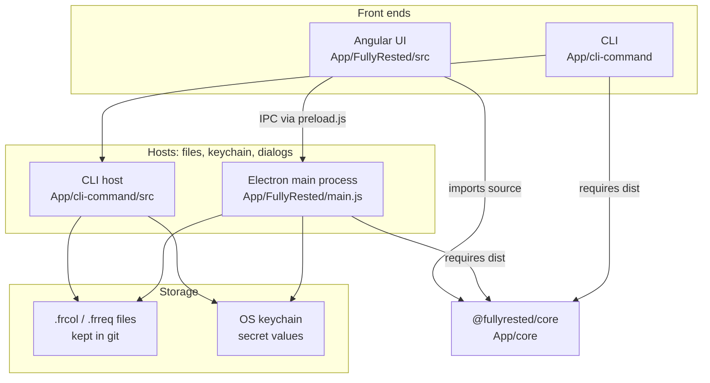

# FullyRested

Purpose: a desktop REST client whose requests are git-friendly JSON files,
with one shared engine behind both the desktop app and a command-line
runner. The intent and the user-facing concepts are in
[`README.md`](README.md).

## Tech stack

Angular 22 (Material) UI in an Electron 44 desktop shell / TypeScript 6 core library
(CommonJS; axios, Ajv, `@smithy/signature-v4`) / Node CLI (commander, vitest).
Nothing is deployed to AWS: the app is a local desktop app.

## Layers

| Layer | Where | Job |
|---|---|---|
| Front ends | `App/FullyRested/src` (Angular), `App/cli-command` | Collect input and show results. Should hold no request logic of their own |
| Hosts | `App/FullyRested/main.js` + `preload.js`; `App/cli-command/src` (`files.ts`, `secret-store.ts`) | Node-only work: reading and writing files, the keychain (`keytar`), dialogs, and the process that sends requests. The CLI host only reads, and takes secrets from `FULLYRESTED_SECRET_<NAME>` before the keychain |
| Core | `App/core/src` | The engine: model, request builder, `{{var}}` / `{{$secret}}` substitution, auth, sending, validation, moving secrets in and out of a `SecretStore` |
| Storage | Collection folder on disk + OS keychain | The data. Secrets are held as references in files and as values in the keychain |

Core has no `node:` or `fs` imports, because the Angular build bundles its
source into the renderer. It compiles to CommonJS, which Electron's main
process and the CLI both `require()`. Anything that touches the machine
belongs in a host. `docs/reviews/2026-09-29-review.md`
records why the packages are linked with `file:` rather than npm workspaces.

## The request pipeline: what's shared

The UI and the CLI run one pipeline. Only file access and reporting differ:

| Step | Where it lives |
|---|---|
| Load a file and fill in its secrets | Host: `main.js` (`loadRequest`, `loadCollectionFromFile`) or the CLI's `files.ts`, both calling core `loadSecrets` |
| Fill in fields missing from older files | core `normaliseAction` / `normaliseCollectionConfig` |
| Resolve settings: run → request → environment → collection | core `resolveRequest` (request + run, called by the request editors) and `applyEnvironment` (called by `ExecuteRestCallsService`); the CLI calls `resolveExecuteAction`, which is both |
| Substitute variables and secrets | core `replaceVariables` / `substituteDeep` |
| Authenticate and send | core `executeRequest`; the app calls it in `main.js` over the `testRest` IPC channel |
| Validate the response | core `validateResponse` |
| Report | Angular response components; the CLI's `report.ts` (text lines, JUnit XML) |

## Where the plan lives

On the BlueFinWiki kanban board, under initiative **AI Refresh**
(`e58ec7d8-09c2-4d67-81b7-9b1b2e72d989`), with epics for the core engine,
secrets hygiene, the CLI runner, the stack upgrade and cleanup. Home's
`configuration/fullyrested/config.json` maps this repo to that initiative.
`docs/reviews/` holds dated reviews; they are snapshots, not living docs.

## Running it

Build order: the app's main process and the CLI load core's compiled
`dist/`, so build core before either. The Angular build compiles core's
source directly, through a `paths` mapping in `App/FullyRested/tsconfig.json`.

| Task | Command (from the folder shown) |
|---|---|
| Build core | `App/core`: `npm install && npm run build` |
| Test core (vitest) | `App/core`: `npm test` |
| Run the desktop app | `App/FullyRested`: `npm run electron` (builds core, runs `ng build`, starts Electron) |
| UI only, in a browser | `App/FullyRested`: `ng serve`. With no Electron IPC, the repository and execute services return built-in mock data |
| Angular unit tests | `App/FullyRested`: `npm test`. The specs are still CLI boilerplate |
| Package installers | `App/FullyRested`: `npm run make` (electron-forge). Not yet checked against the `file:../core` link |
| Build and try the CLI | `App/cli-command`: `npm run build` (builds core too), then `node dist/index.js run --help`; `npm link` puts `fullyrested` on the PATH |
| Test the CLI (vitest) | `App/cli-command`: `npm test` |

Runtime state: the app keeps its open tabs and recent collections in
`current_state.json` in Electron's userData folder. Secrets are stored under
the keychain services `fullyrested-collection-<collectionGuid>` and
`fullyrested-request-<requestId>`.
